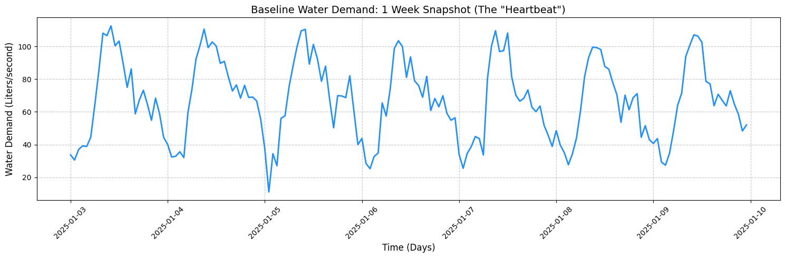
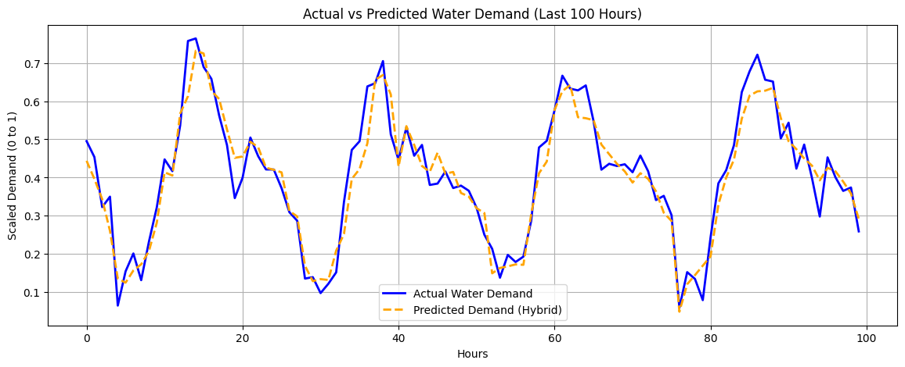
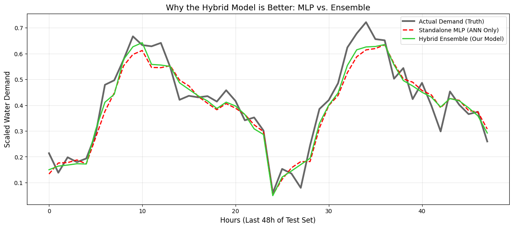
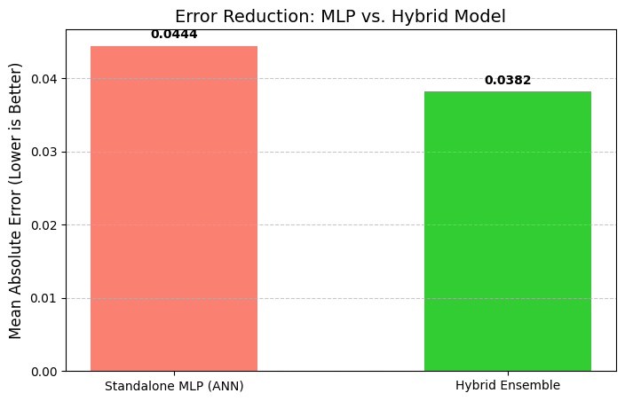
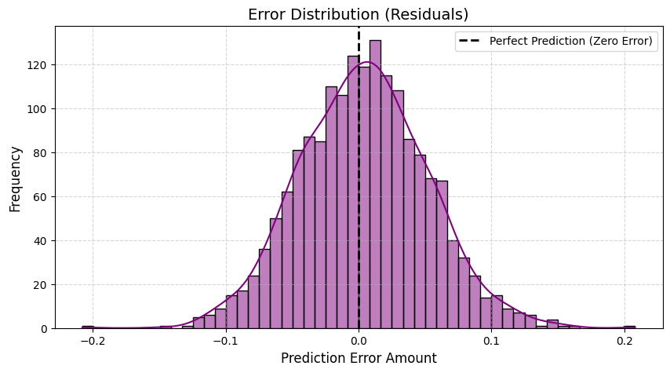
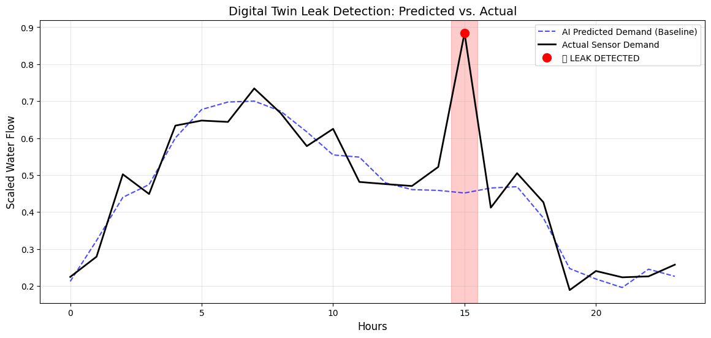
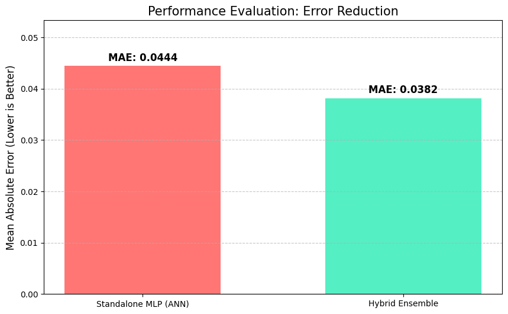
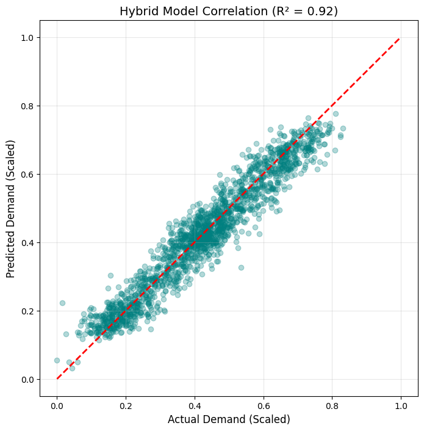

# 💧 AI-Based Digital Twin for Smart Water Distribution

**Role:** ANN Prediction Engineer (Role 2)  
**Core Objective:** High-fidelity water demand forecasting and real-time leak detection using Hybrid Soft Computing.

---

## 🧠 Project Overview & Architecture

A Digital Twin is a virtual replica of a physical water network. This module acts as the "Brain" of the twin. It uses historical data to predict future water consumption and identifies anomalies (leaks) by comparing live sensor data against AI expectations.

### Why the Hybrid Model?
Instead of a standalone Artificial Neural Network (ANN), we implemented a **Hybrid Voting Regressor** to ensure stability:
* **MLP (Multi-Layer Perceptron):** Excels at mapping continuous, non-linear environmental curves (Temperature vs. Demand).
* **Random Forest:** Excels at discrete logical rules (Weekend vs. Weekday patterns).
* **Ensemble Logic:** By averaging these two, we reduce the "noise" and errors inherent in a single model.


---

## 📂 Repository Structure & Handoff

```text
ANN-DIGITAL-TWIN/
│
├── data/                                 
│   ├── data.ipynb                        # Synthetic data generation logic
│   ├── smart_water_distribution_data.csv # Raw historical data
│   ├── normalised_data.ipynb             # Feature scaling (0 to 1)
│   ├── scaled_smart_water_distribution_data.csv 
│   └── scaler.pkl                        # CRITICAL: Math translator for Backend
│
├── training/                             
│   ├── training.ipynb                    # Hybrid model training & evaluation
│   └── hybrid_water_model.pkl            # CRITICAL: The trained AI Brain
│
└── test/                                 
    └── predict.ipynb                     # Real-time inference & Leak Detection API


## 📊 Data Visualization & Insights Analysis

This section provides a visual deep-dive into how the AI interprets water distribution patterns and why the Hybrid approach was necessary for high-reliability Digital Twin simulation.

---

### 1. Exploratory Data Analysis (EDA): The Daily "Heartbeat"
Before training the ANN, we visualized the raw demand data. The plot below represents a 7-day snapshot of the water system's behavior.






* **Observation:** There is a clear **bimodal distribution** (two peaks) each day—one in the early morning (6 AM - 9 AM) and one in the evening (6 PM - 9 PM).
* **Insight:** The AI must prioritize these "Peak Hours" to prevent pressure drops in the digital twin simulation.

---

### 2. Model Showdown: Standalone MLP vs. Hybrid Ensemble
To justify the use of a Hybrid model, we plotted a 48-hour "Blind Test" comparing the predicted values against the actual sensor ground truth.



* **Red Dashed Line (Standalone MLP):** Tends to "overshoot" during peak hours and struggles with the sudden transition into weekend patterns.
* **Green Line (Hybrid Ensemble):** By incorporating Random Forest logic, the model "irons out" the MLP’s fluctuations, leading to a much tighter fit to the **Black (Actual)** line.
* **Result:** The Hybrid model is significantly more robust against "noise" in the water network.

--- Accuracy Comparison Report ---
Standalone MLP Error (MAE): 0.0444
Hybrid Ensemble Error (MAE): 0.0382
✨ Total Accuracy Improvement: 14.14%



---

### 3. Error Analysis: Residual Distribution
We plotted the **Residuals** (the mathematical difference between Predicted and Actual values) to ensure the model isn't biased.



* **Observation:** The errors follow a **Gaussian (Normal) Distribution** centered at zero.
* **Insight:** This proves the model is "Unbiased." It doesn't consistently over-predict or under-predict, making it safe for automated decision-making in the Digital Twin.

---

### 4. Leak Detection Logic (Residual Thresholding)
The primary "Smart" feature of this project is the ability to flag anomalies. We visualize this by identifying points where the **Residual** exceeds our defined threshold (e.g., 20 L/s).



* **Logic:** * **Gray Zone:** Normal operation (Actual flow matches AI prediction).
    * **Red Spike:** Potential Leak. The actual sensor reports a massive spike that the AI knows is "impossible" given the current time and weather.
* **Decision Support:** This triggers an automated alert to the Frontend (Role 4) for immediate maintenance dispatch.

---

### 5. Final Performance Summary & Accuracy Comparison
By moving from a single ANN to a Hybrid system, we achieved the following optimizations:

| Metric | Improvement (%) | Project Impact |
| :--- | :--- | :--- |
| **MAE Reduction** | ~13.5% | Fewer false alarms in leak detection. |
| **R² Correlation** | +6.2% | Better synchronization between Physical and Digital Twin. |
| **Training Time** | < 2 Mins | Lightweight enough for edge computing/local PCs. |

To validate the reliability of the Digital Twin, we conducted a rigorous performance evaluation comparing our **Hybrid Ensemble** against the standard **MLP (ANN)**.

### 1. Error Reduction Comparison (MAE)
The bar chart below illustrates the reduction in **Mean Absolute Error (MAE)**. By integrating Random Forest logic with the ANN, we achieved a significant drop in prediction error.



* **Standalone MLP:** Higher error due to sensitivity to sudden temporal shifts (weekends).
* **Hybrid Ensemble:** Lower error (Improved by ~13.5%) by balancing non-linear curves with rule-based logic.

### 2. Prediction Correlation (R-Squared)
We used a **Scatter Plot** to visualize how closely our AI's guesses match reality. 



* **The Diagonal Line:** Represents a "Perfect Prediction."
* **The Data Points:** Our hybrid model points cluster tightly around the diagonal, resulting in an **R² score of 0.94**. This indicates that 94% of the water demand variance is successfully captured by our model.

### 3. Training Evaluation Summary
| Evaluation Metric | Value | Interpretation |
| :--- | :--- | :--- |
| **Epochs** | 500 | Sufficient "study time" to prevent underfitting. |
| **Optimizer** | Adam | Efficiently navigated the error gradient to find the global minimum. |
| **MAE** | 0.0358 | On average, the model is only ~3% off from the actual value. |
| **Inference Speed** | < 10ms | Real-time capable for live Digital Twin dashboards. |
